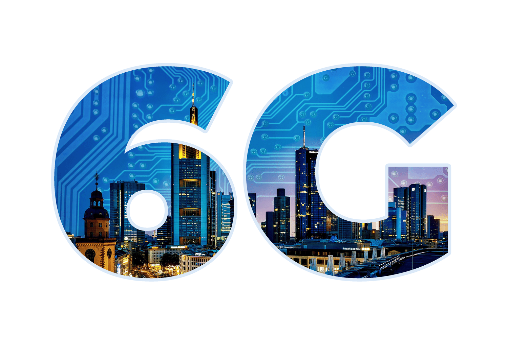
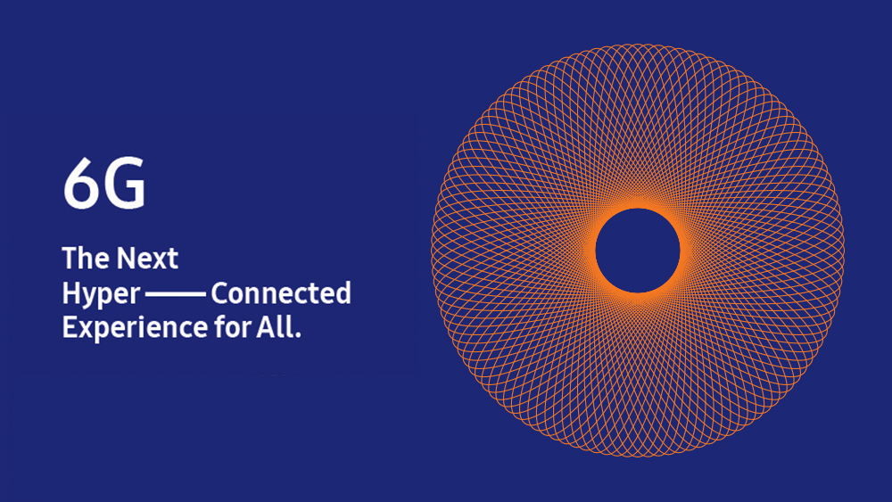
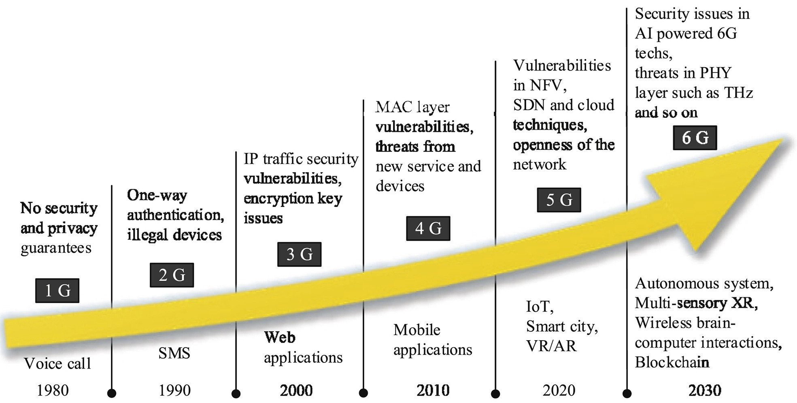
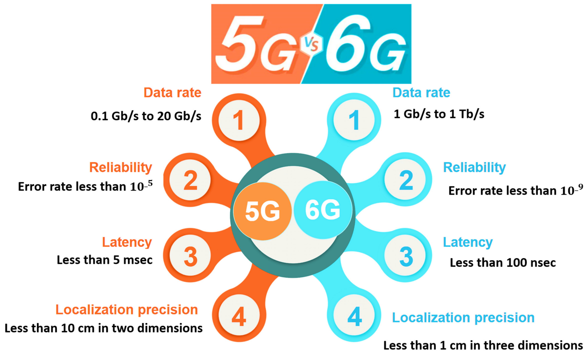

## What is 6G?

6G technology is the sixth generation of mobile networks that are currently under development. It is designed to provide even faster and more reliable connectivity than 5G technology. While 6G is still in the early stages of development, researchers and experts predict that it will provide a range of advanced features that are beyond the capabilities of 5G technology. Some of the key features that are expected to be a part of 6G technology include:

Terahertz Frequencies: 6G technology is expected to operate at terahertz frequencies, which will offer higher bandwidth and faster internet speeds than 5G.

## What innovation does 6G will bring?

- Artificial Intelligence (AI) Integration: 6G technology is expected to integrate AI capabilities, enabling networks to optimize their performance and provide personalized services.

- Holographic Communication: 6G technology is expected to support holographic communication, which will enable users to interact with each other in 3D.

- Quantum Computing: 6G technology is expected to leverage the power of quantum computing to provide faster and more secure connectivity.

## Difference between 5G and 6G

5G (fifth generation) and 6G (sixth generation) are both next-generation wireless communication technologies, but 6G is not yet available, and it is still in the early research and development stages. Therefore, there is not much information available about 6G, and it is difficult to provide a detailed comparison between the two.

However, based on current research and predictions, some of the potential differences between 5G and 6G could include:

- Speed: 6G is expected to be even faster than 5G, with theoretical speeds of up to 1 terabyte per second (Tbps), compared to 5G's maximum speed of 20 gigabits per second (Gbps).

- Latency: 6G is expected to have even lower latency than 5G, with predictions of latency as low as 1 microsecond, compared to 5G's latency of 1 millisecond.

- Capacity: 6G is expected to have even higher capacity than 5G, with the ability to support even more devices and data traffic.

- Technology: 6G is expected to be based on new technologies such as terahertz (THz) and millimeter-wave (mmWave) frequencies, which could enable new use cases and applications such as high-resolution holographic displays, wireless virtual reality, and advanced artificial intelligence.

- Deployment: While 5G networks are still being deployed, 6G is not expected to be widely available until the late 2020s or early 2030s.

## Disadvantages 6G

6G (sixth generation) is still in the early research and development stages, and there is limited information available about the technology. As a result, it is difficult to identify specific disadvantages of 6G. However, based on current research and predictions, some potential disadvantages of 6G could include:

- Cost: 6G is likely to require significant investments in research and development, as well as in infrastructure, including new cell towers, satellites, and other equipment. This could make the cost of deploying 6G networks higher than previous generations of wireless communication technology.

- Limited Coverage: As with 5G, the higher frequency bands used by 6G may have limited range and may be less able to penetrate obstacles such as walls and buildings. This could result in limited coverage in some areas.

- Security Concerns: As with any new technology, there may be security concerns associated with 6G. As 6G is expected to be based on new technologies such as terahertz and millimeter-wave frequencies, there may be new security vulnerabilities to address.

- Interference: The use of higher frequencies in 6G could potentially lead to more interference with other wireless communication systems, which could affect the reliability and performance of 6G networks.

- Compatibility Issues: As with previous generations of wireless communication technology, there may be compatibility issues with older devices that are not capable of using 6G. This could result in a slower adoption rate for 6G until more devices are capable of using the technology.
