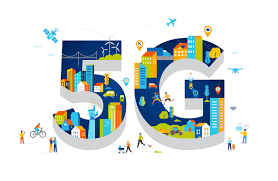
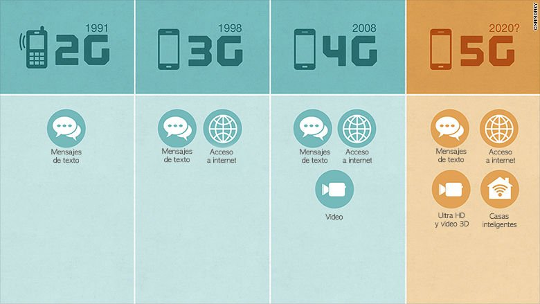
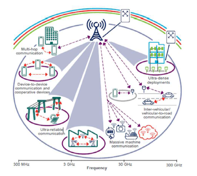

## What is 5G?

5G technology is the fifth generation of mobile networks. It is the successor to 4G technology, and it is designed to provide faster and more reliable connectivity to a large number of devices. The technology uses a combination of new hardware, software, and advanced infrastructure to offer significant improvements in speed, latency, and network capacity. Some of the key features of 5G technology include:

- High-speed internet connectivity: 5G technology is designed to provide internet speeds that are significantly faster than 4G. It is capable of delivering download speeds of up to 20 Gbps, which is nearly 20 times faster than 4G.

- Low Latency: Latency refers to the time taken by a network to respond to a request. 5G technology is designed to reduce latency to a great extent, resulting in better user experience for real-time applications like online gaming, virtual reality, and augmented reality.

- Improved Network Capacity: 5G technology is designed to support a large number of devices on a single network, making it ideal for the Internet of Things (IoT) applications.

- Improved Network Security: 5G technology uses advanced encryption methods and protocols to provide better security for data transmission over the network.

## Difference between 4G

5G (fifth generation) and 4G (fourth generation) are both cellular network technologies used to provide wireless communication between devices. However, there are several differences between the two:

- Speed: 5G is faster than 4G. While 4G can deliver download speeds of up to 100Mbps, 5G can provide speeds of up to 20Gbps.

- Latency: 5G has lower latency than 4G. Latency is the time it takes for a signal to travel from the source to the destination. With 5G, latency can be as low as 1 millisecond, compared to 4G's 30-50 milliseconds.

- Capacity: 5G has a higher capacity than 4G. This means that it can support more devices and data traffic, making it more efficient for crowded areas like stadiums or airports.

- Coverage: 4G has better coverage than 5G. This is because 4G uses lower frequency bands that can travel further and penetrate walls and obstacles more easily than the higher frequency bands used by 5G.

- Deployment: 5G is still being rolled out, while 4G is widely available. This means that while 5G may provide faster speeds and lower latency, it may not be available in all areas yet.

## Disadvantages 5G

While 5G (fifth generation) technology offers many advantages, there are also some potential disadvantages, including:

Higher Cost: 5G technology requires new infrastructure, including new cell towers and other equipment, which can be expensive to install and maintain. As a result, the cost of deploying 5G networks may be higher than 4G networks, which could ultimately lead to higher costs for consumers.

- Limited Coverage: Although 5G networks are being rolled out quickly, they are still not available in all areas. Additionally, the higher frequency bands used by 5G have less range and are less able to penetrate walls and obstacles, which means that 5G networks may have limited coverage in some areas.

- Security Concerns: As with any new technology, there are security concerns around 5G networks. For example, there are concerns that 5G networks may be more vulnerable to hacking and cyber attacks.

- Health Concerns: Some people have raised concerns about the potential health effects of exposure to 5G radio waves. However, there is currently no conclusive scientific evidence that 5G technology poses any significant health risks.

- Compatibility Issues: 5G technology is not yet fully compatible with all existing devices, which means that some devices may not be able to take advantage of the new technology without upgrades or replacements.

